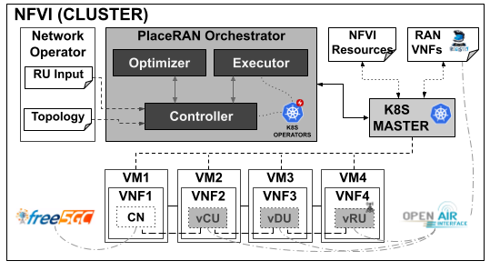

# RAN Placer Architecture

## Overview

The PlaceRAN Orchestrator is composed of the following components:

1. Controller (RANPlacer): Manages the placement execution and the RANDeployer creation.
2. Executor (RANDeployer): Manages the life cycle of the Virtual Network Functions (VNFs).
3. Optimizer: Compound for Scheduler Manager and Algorithm Jobs.
   3.1 Scheduler Manager: Manages the algorithm's executions.
   3.2 Algorithm Jobs: Execute the placement algorithms and store the results.

### Controller (RANPlacer)

The Controller is responsible for handling the placement requests
triggered by the Network Operator (NO) input. It triggers the placement modeling
through the Scheduler API, provides the placement result once it is finished, and
creates the required Executor resources to start the VNFs in the selected nodes.

The Controller receives the following arguments:

1. RAN Topology name.
2. RUs position.
3. PlaceRAN Placement Optimization.
4. Nodes information (Optional - if not provided will be calculated).

### Executor (RANDeployer)

The Executor is responsible for managing the life-cycle of a chain of
VNFs. A chain is generally composed of a CU, DU, and RU that communicate with
the Core Network (CN).

The Executor creates all the required resources for VNFs execution and cleans
up the environment once deleted.

### Optimizer

The Scheduler Manager receives the requests from the Controller with the inputs
for the modeling execution. The input is composed of the following information:

1. Nodes Information: Contains the resources (CPU and Memory), node type (Core Network, Aggregation Layer), and links count.
2. Network Topology: Description of the network, such as links and the link's capacity (bandwidth and latency).
3. PlaceRAN Placement Optimization: Defines the placement algorithm that should be used.
4. RUs Position: Describes the number of RUs and where they should be placed.

## Prototype Details

The architecture is implemented on top of K8S and with the development of Controller and Executor K8S operators.
Besides of emulating de RAN with OAI and Core with Free5GC.
